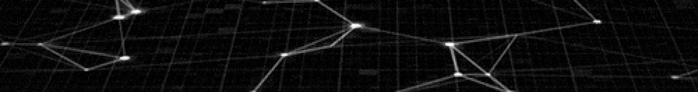

<!-- This readme was created by Gabriel Coutinho - https://github.com/gabriel-079 -->

    

    

    <h3 align="center">Hello
        World!</h3>
    
⚡ Fun fact: ... Called the Apollo Guidance Computer (AGC), with just over 4 MB of RAM memory for reading data,
        in addition to 72 KB of ROM memory, the computer on board the spacecraft had the processing capacity of a toy
        notebook from the current days.

    <h3>🛠 Languages, Frameworks, Tools and Abilities</h3>
    
    
    
    
    
    
    

    <h3>📊 Github Stats</h3>
    
    <a href="https://github.com/gabriel-079">
        
        

    <h3>🧐 More About Me</h3>
    
🔭 I’m currently working on ...

    
🌱 I’m currently learning ... 

    <h3>📬 Connect with me</h3>
    
    
    

    <h3></h3>
    

<!-- This readme was created by Gabriel Coutinho - https://github.com/gabriel-079 -->
